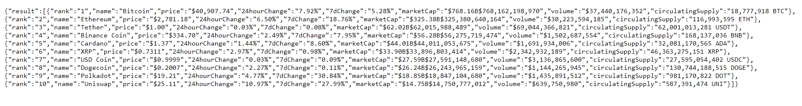

# Crypto Web Scraper

A web scraper, which scrapes cryptocurrency data.\
[Live site](https://crypto-web-scraper.herokuapp.com/)

## Description

I created a web scraper, which scrapes cryptocurrency data from the [CoinMarketCap](https://coinmarketcap.com/) website.\
By using [Axios](https://axios-http.com/docs/intro), I defined which site was going to be scraped and how it would get scraped.\
I looked the source code to find a pattern about the information displayed.\
Information was stored in table-data tags. So, by using the Dev-Tools, I copy the selector of that element.\
Then, I used [Cheerio](https://cheerio.js.org/) to target the table-data element which was going to be used to retreive back the data.\
Right after, I created an array to store the crypto details, an object which would be populated by said crypto\
details, and an array of objects, which would display the details for only the first 10 entries.\
Finally, I initialized an [Express](https://expressjs.com/) server to output the data.



Although console logging the data would return a readable JSON of the crypto information, as you can see, that's not the case on the express server.\
Needless to say that not everyone has a JSON Formatter extension, so I had to make the output readable.\
All I needed to do was to add this line inside the express server:

```
    app.set("json spaces", 2);
```

And that was it. A much better data output.


## Installation

- Download / fork the project.

- Install dependencies:

```
npm install
```

- Initialize project.

```
npm run dev
```
